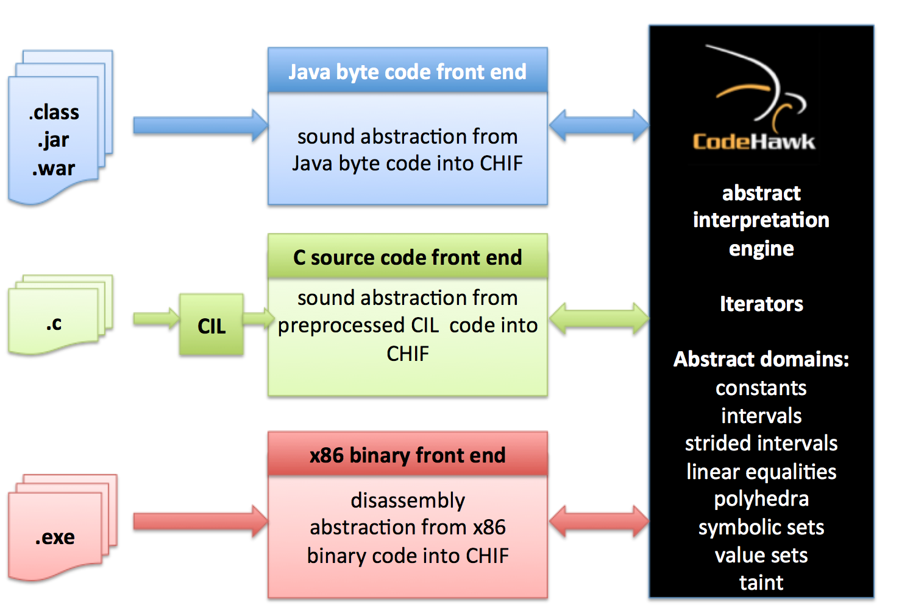

# CodeHawk Tool Suite

The CodeHawk Tool Suite, originally developed by Kestrel Technology, is a sound
static analysis platform based on the mathematical theory of
abstract interpretation developed by Patrick and Radhia Cousot.
CodeHawk consists of a programming-language independent abstract
interpretation engine and three language front ends, as shown
.

This repository contains the source code for the abstract
interpretation engine and the three analyzer front ends:

- **CH**: Abstract Interpretation Engine and utilities
- **CHB**: Binary analyzer (x86, mips) front end
- **CHC**: C source code analyzer front end
- **CHJ**: Java byte code analyzer (in preparation)

The ocaml-doc documentation for the code in this repository can be found on the
[GitHub pages](https://static-analysis-engineering.github.io/codehawk/)

The code in this repository forms the back-end for the three analyzer
front-ends found here:

- **CodeHawk-Binary**: [Binary Analyzer](https://github.com/static-analysis-engineering/CodeHawk-Binary)
- **CodeHawk-C**: [C Source Code Analyzer](https://github.com/static-analysis-engineering/CodeHawk-C)
- **CodeHawk-Java**: [Java byte code Analyzer](https://github.com/static-analysis-engineering/CodeHawk-Java)

